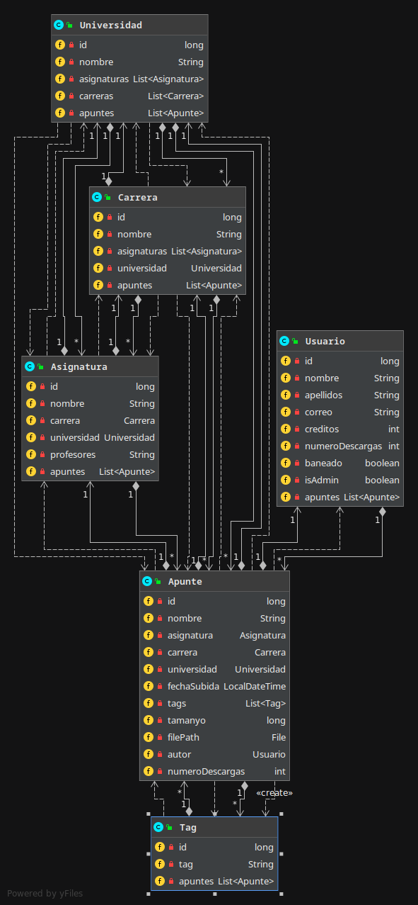
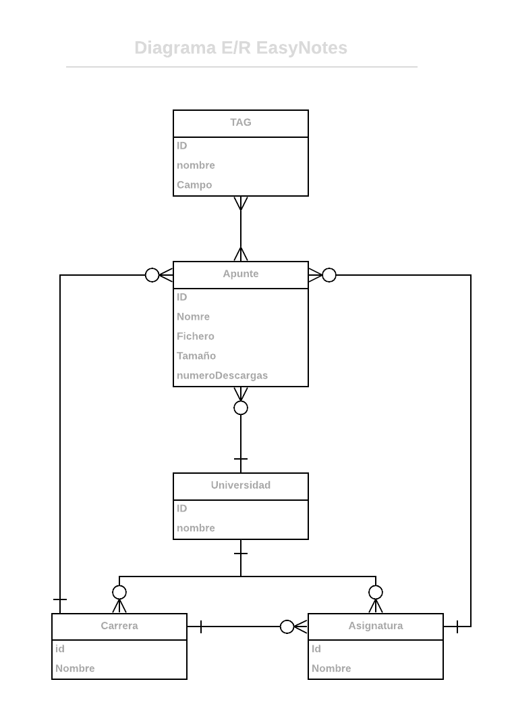

# easyNotes

 Este repositorio contiene una aplicación web que trata sobre un repositorio de apuntes y exámenes.
 Los usuarios guest (invitados), es decir, los que no están logueados, pueden mirar un preview de los apuntes.
 Para poder descargar los apuntes / exámenes en su totalidad es necesario estar logueado.
 Para poder acceder a exámenes se creará un sistema de micropagos. Estos se podrán conseguir de varias maneras:
 en el primer registro se regalarán, y posteriormente subiendo apuntes o exámenes a la web.

## Funcionalidades públicas (los usuarios guest):
* Leer las primeras páginas (preview) de un documento
* Búsqueda por universdad, asignatura, carrera o tag
* Registrarse y loguearse

## Funcionalidades privadas (usuarios logueados):
* Funcionalidades públicas de los usuarios guest
* Descargar apuntes en formato original
* Comprar exámenes (si tienen fotos incluidas se incluyen en la compra)
* Publicar apuntes o exámenes
* Publicar/Añadir capturas de apuntes o imágenes (formato png o jpg)
* Seguir asignaturas (notificaciones por mail cuando se publique nuevo contenido)
* Añadir una asignatura (tiene que ser calidad por el administrador)

## Funcionalidades privadas (solo los administradores):
* El administrador puede eliminar cualquier documento
* El administrador puede banear a cualquier usuario
* Tiene acceso a todos los datos de contacto de cada usuario
* Validar asignaturas creadas por usuarios

## Entidades
* Apunte: asignatura, autor, categoría (teoría, ejercicios), tipo de dato, tamaño, fecha, opiniones, valoraciones,
número de descargas, tags
* Examen: hereda de Apunte, profesores
* Asignatura: nombre, universidad, carrera, profesores
* Usuario: tipo de usuario (administrador o registrado), nombre, apellidos, correo electrónico, créditos,
número de descargas, estado de la cuenta (baneado o no)
* Universidad: nombre, campus

## Servicio interino
* Mandar de forma automática un email cuando se actualice una asignatura
* Mandar de forma automática un email cuando el documento de ha descargado más de (5) veces
* Convertir los ficheros en formato PDF

## Modelo de datos

## Diagrama Entidad/Relación

## Integrantes
* Guillermo De Azcarate Acosta
    * Correo electrónico: g.deazcarate.2016@alumnos.urjc.es
    * Github: https://github.com/Guilleazca98
* Pablo López Parrilla
    * Correo electrónico: p.lopezpar@alumnos.urjc.es
    * Github: https://github.com/pavloXd
* Valentino Lin
    * Correo electrónico: v.lin.2016@alumnos.urjc.es
    * Github: https://github.com/vlt23
