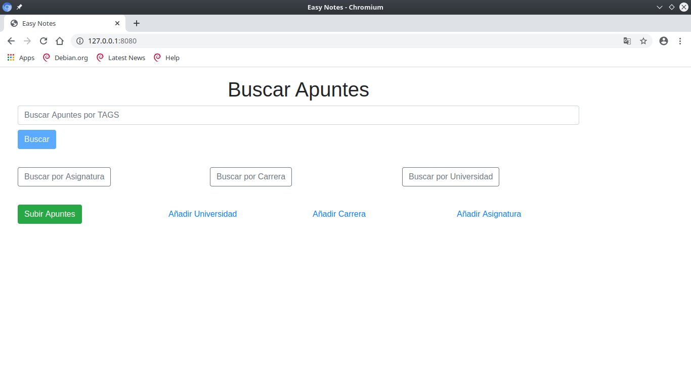
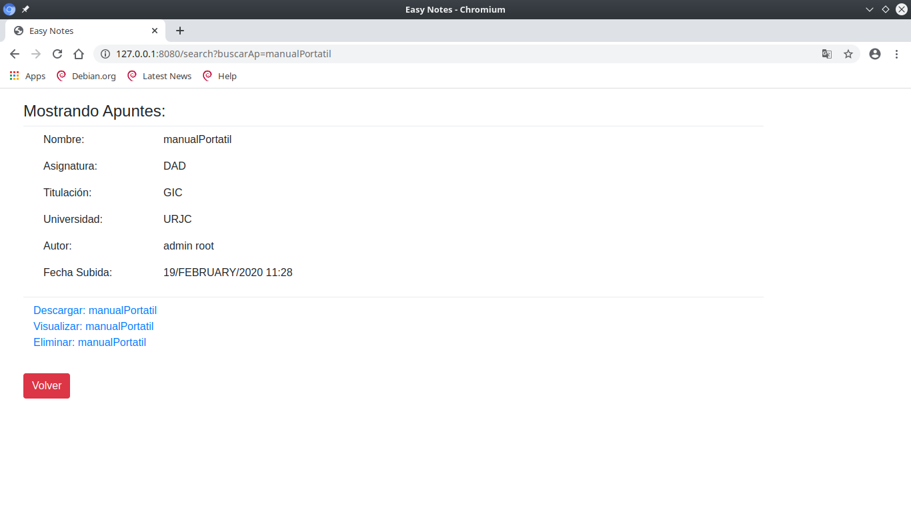
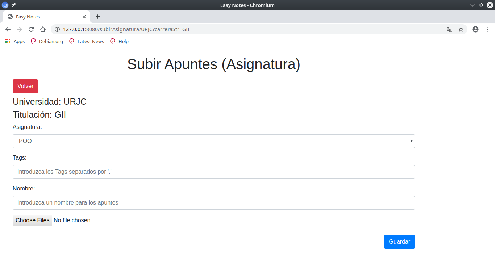
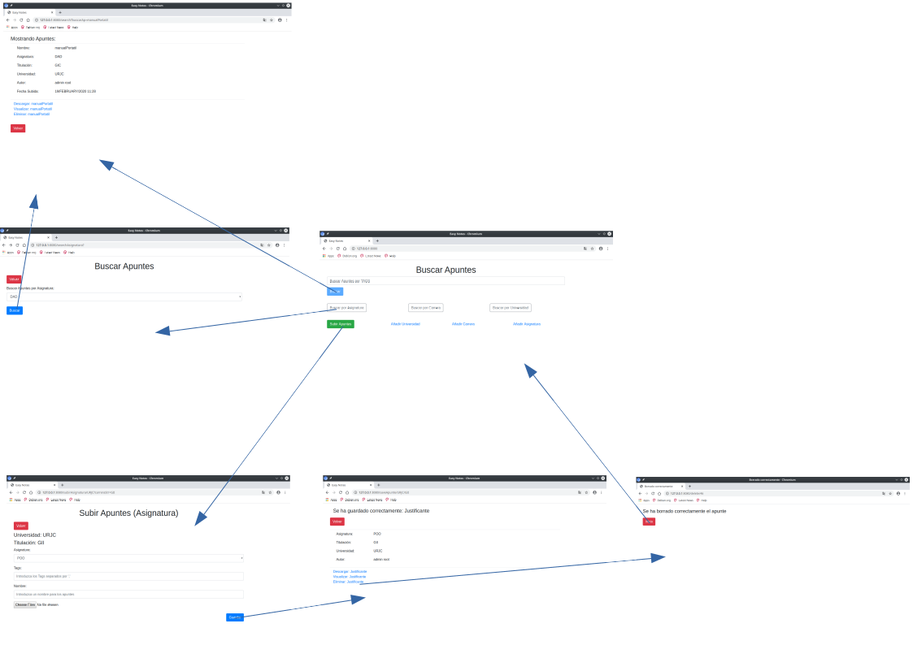

# easyNotes

 Este repositorio contiene una aplicación web que trata sobre un repositorio de apuntes y exámenes.
 Los usuarios guest (invitados), es decir, los que no están logueados, pueden mirar un preview de los apuntes.
 Para poder descargar los apuntes / exámenes en su totalidad es necesario estar logueado.
 Para poder acceder a exámenes se creará un sistema de micropagos. Estos se podrán conseguir de varias maneras:
 en el primer registro se regalarán, y posteriormente subiendo apuntes o exámenes a la web.

## Funcionalidades públicas (los usuarios guest):
* Leer el documento
* Búsqueda por universdad, asignatura, carrera o tag
* Registrarse y loguearse

## Funcionalidades privadas (usuarios logueados):
* Funcionalidades públicas de los usuarios guest
* Descargar apuntes
* Comprar exámenes
* Publicar apuntes o exámenes en formato PDF
* Seguir asignaturas (notificaciones por mail cuando se publique nuevo contenido)
* Añadir una asignatura (tiene que ser validada por el administrador)(notificacion por mail)

## Funcionalidades privadas (solo los administradores):
* El administrador puede eliminar cualquier documento
* Tiene acceso a todos los datos de contacto de cada usuario
* Validar asignaturas creadas por usuarios

## Entidades
* Apunte: asignatura, carrera, universidad, autor, tamaño, fecha,  valoraciones,número de descargas, tags, tipo (apunte o examen)
* Usuario: tipo de usuario (administrador o registrado), nombre, apellidos, correo electrónico, créditos,
número de descargas
* Universidad: nombre, carreras, asignaturas
* Carrera: nombre, universidad, asignaturas
* Asignatura: nombre, universidad, carrera
* Tag: nombre, apuntes

## Servicio interino
* Mandar de forma automática un email cuando se actualice una asignatura
* Mandar de forma automática un email cuando el documento de ha descargado más de (5) veces

## Capturas de pantalla

Página de inicio, donde están todas las opciones.

Página de resultados tras buscar apuntes por tags.

Página para buscar todos los apuntes de un determinado asignatura.
Los otros dos páginas (Buscar por Carrera y Buscar por Universidad) tienen la misma estructura.

Página para subir los apuntes. Se selecciona la universidad, la titulación y la asignatura.
Se pueden añadir tags si lo desea.

## Diagrama de navegación

## Modelo de datos

## Diagrama Entidad/Relación

## Integrantes
* Guillermo De Azcarate Acosta
    * Correo electrónico: g.deazcarate.2016@alumnos.urjc.es
    * Github: https://github.com/Guilleazca98
* Pablo López Parrilla
    * Correo electrónico: p.lopezpar@alumnos.urjc.es
    * Github: https://github.com/pavloXd
* Valentino Lin
    * Correo electrónico: v.lin.2016@alumnos.urjc.es
    * Github: https://github.com/vlt23
